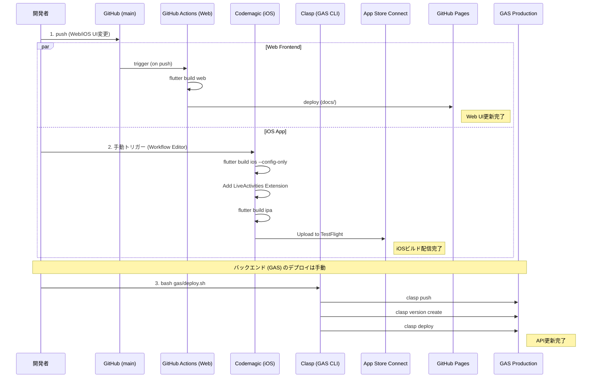
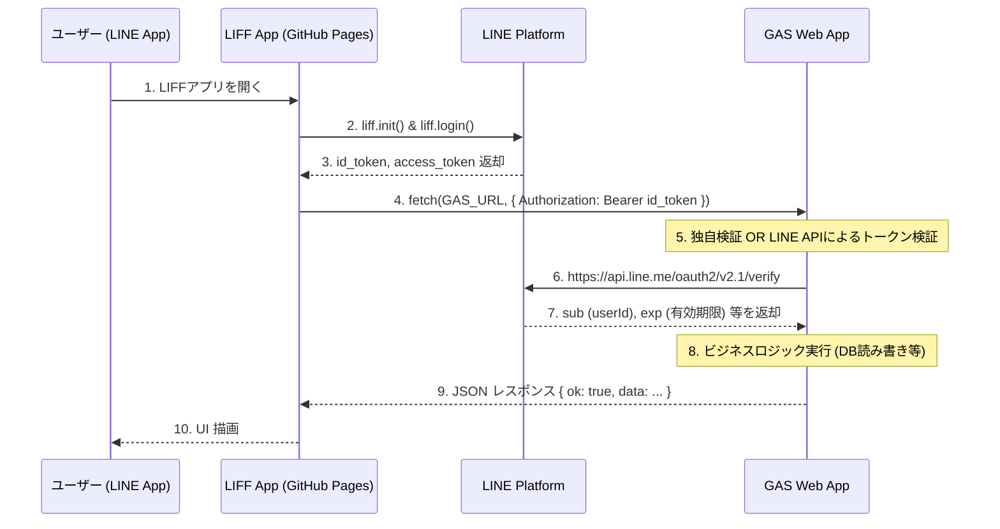

# システムアーキテクチャ図（テンプレート）

このドキュメントは、新規プロジェクト作成時の `ARCHITECTURE.md` のテンプレートとして利用されるシステム構成図です。[Mermaid](https://mermaid.js.org/) 記法を使用しており、GitHub や多くの Markdown エディタで直接描画されます。

プロジェクトの要件に応じて、不要なコンポーネントを削って使用してください。

## 1. 包括的システム構成図（フル構成）

Flutter (Web / iOS / Android) と GAS バックエンド、Cloud Run（レガシーや重い処理用）、および各種外部 API を組み合わせた、最も広範な構成例です。

```mermaid
graph TD
    %% ユーザー・デバイス層
    subgraph Clients ["クライアント層 (Frontend)"]
        Browser["🌐 Web Browser\n(GitHub Pages / Firebase Hosting)"]
        App_iOS["📱 iOS App\n(App Store / TestFlight)"]
        LINE_LIFF["💬 LINE LIFF\n(WebView in LINE)"]
    end

    %% 外部サービス・認証層
    subgraph Auth_APIs ["外部サービス・認証・連携 API"]
        GoogleSignIn["🔑 Google Sign-In"]
        GoogleDrive["☁️ Google Drive API\n(ユーザー固有のバックアップ)"]
        YouTubeAPI["📺 YouTube Data API v3"]
        LINE_Msg_API["💬 LINE Messaging API\n(Webhook / Push Message)"]
    end

    %% バックエンド層（GASベース）
    subgraph Backend_GAS ["バックエンド層 (Google Apps Script)"]
        GAS_WebApp["⚡ GAS Web App\n(doGet / doPost)"]
        GAS_Trigger["⏱️ Time-driven Triggers\n(Cron Jobs)"]
        Spreadsheet[("📊 Google Sheets\n(Master DB / Audit Log)")]
    end

    %% バックエンド層（コンテナベース・重い処理用）
    subgraph Backend_CloudRun ["バックエンド層 (Cloud Run / FastAPI)"]
        FastAPI["🐍 Python FastAPI\n(REST API / Heavy Processing)"]
        CloudRun["☁️ GCP Cloud Run"]
        Supabase[("🐘 PostgreSQL\n(Supabase / Connection Pooling)")]
    end

    %% 外部連携（AI等）
    subgraph External_Integrations ["外部システム連携"]
        GeminiAPI["🧠 Gemini API\n(LLM Parsing / OCR)"]
    end

    %% CI/CD層
    subgraph CI_CD ["CI/CD・自動化"]
        GitHubActions["🐙 GitHub Actions\n(Web デプロイ)"]
        Codemagic["✨ Codemagic\n(iOS/Android ビルド)"]
    end

    %% -- データの流れと接続 --

    %% クライアント -> 認証・連携
    Clients -.->|OAuth 2.0| GoogleSignIn
    App_iOS <-->|Backup / Restore| GoogleDrive
    App_iOS <-->|Upload / Metadata| YouTubeAPI

    %% クライアント -> GAS
    Browser <-->|Fetch API (CORS)| GAS_WebApp
    LINE_LIFF <-->|Fetch API + id_token| GAS_WebApp

    %% LINEシステム連携
    LINE_Msg_API -->|Webhook POST| GAS_WebApp
    GAS_WebApp -->|Push / Reply| LINE_Msg_API

    %% GAS内部
    GAS_WebApp <-->|Read / Write| Spreadsheet
    GAS_Trigger -->|Scheduled Run| GAS_WebApp
    
    %% クライアント -> Cloud Run (オプション)
    Clients <-->|REST API| FastAPI
    FastAPI --- CloudRun
    FastAPI <-->|SQL| Supabase

    %% バックエンド -> 外部
    GAS_WebApp <-->|UrlFetchApp| GeminiAPI
    FastAPI <-->|HTTP Client| GeminiAPI

    %% CI/CD デプロイ
    GitHubActions -.->|Deploy docs/| Browser
    Codemagic -.->|Upload ipa| App_iOS

    %% スタイリング
    classDef client fill:#e1f5fe,stroke:#01579b,stroke-width:2px;
    classDef backend fill:#e8f5e9,stroke:#1b5e20,stroke-width:2px;
    classDef db fill:#fff8e1,stroke:#f57f17,stroke-width:2px;
    classDef external fill:#f3e5f5,stroke:#4a148c,stroke-width:2px;
    classDef cicd fill:#eeeeee,stroke:#424242,stroke-width:2px;

    class Browser,App_iOS,LINE_LIFF client;
    class GAS_WebApp,GAS_Trigger,FastAPI,CloudRun backend;
    class Spreadsheet,Supabase db;
    class GoogleSignIn,GoogleDrive,YouTubeAPI,LINE_Msg_API,GeminiAPI external;
    class GitHubActions,Codemagic cicd;
```

## 2. デプロイメント・CI/CD フロー図

ソースコードから本番環境（Web、iOS、GAS）へのデプロイパイプラインの構成図です。



## 3. LINE LIFF と GAS API の認証・通信フロー

LIFF（静的ホスティング）からGASへの安全な通信手順です。


